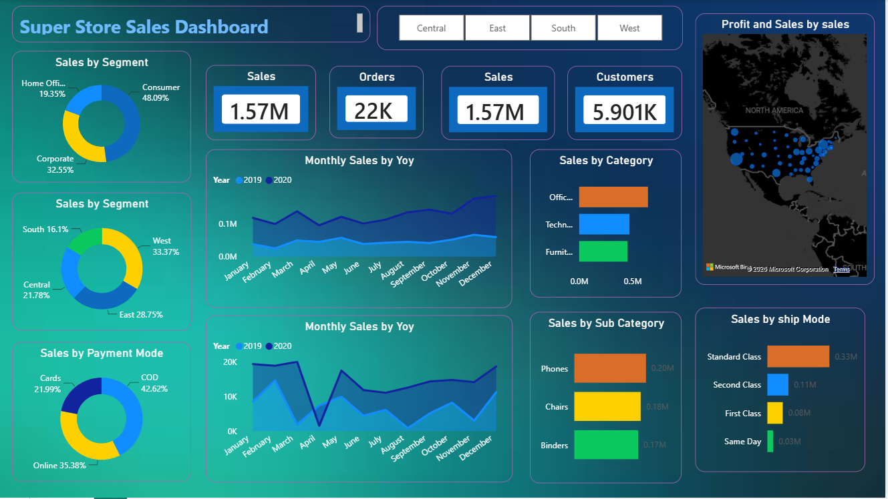
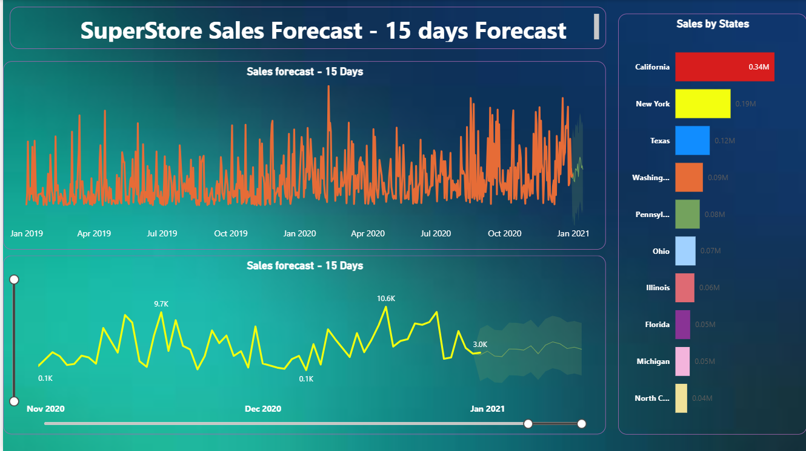

# Sales Analytics Dashboard

## Dashboard Preview

## Forecast Analysis

## Overview

This project presents an interactive Sales Analytics Dashboard developed using Power BI. The dashboard provides insights into sales performance, profitability, customer behavior, and future sales trends.

## Key Features

- Total Sales Analysis
- Profit Analysis
- Order Tracking
- Regional Performance Analysis
- Category and Sub-Category Insights
- Sales Forecasting
- Interactive Filters and Slicers

## Tools Used

- Power BI
- DAX
- CSV Dataset
- Data Visualization

## Dataset

SuperStore Sales Dataset

